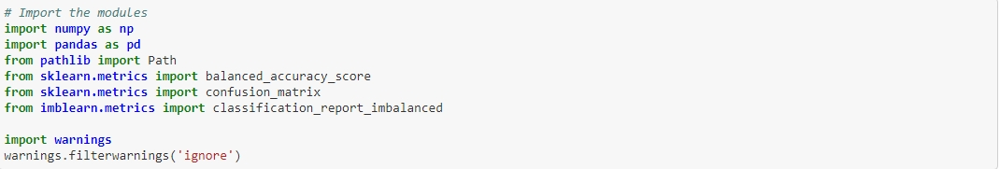
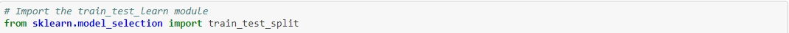
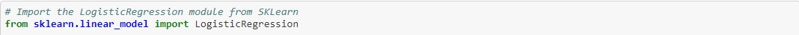
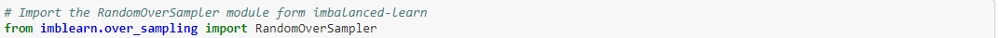

# Challenge-12

## Credit Risk

The purpose of this analysis was to use customer information to determine if a loan was healthy or unhealthy for a peer to peer lending company

Step 1: Create 

Step 2: Mine the search traffic data for seasonality

Step 3: Relate the search traffic to stock price patterns

Step 4: Create a time series model with Prophet

Step 5 (optional): Forecast revenue by using time series models


---

## Technologies
This application is written in Python 3.7  

this application uses the following packages:
 
pandas

numpy 

sklearn

imblearn

pathlib

---

## Installation Guide

Before running the application first install the following dependencies.
See the associated Screenshot for what to Install 









---

## Examples

Please see the following images of the code and resulting graphs 


---

## Usage

To use the data simply clone the repository.

Different sales values can be imput and the projections will change as well 

Charts could also be changed to make things look different  
```
---

## Contributors

Sean Patel (myself) seanpatel076@gmail.com
---

## License

License is public anyone can use or make changes to this application